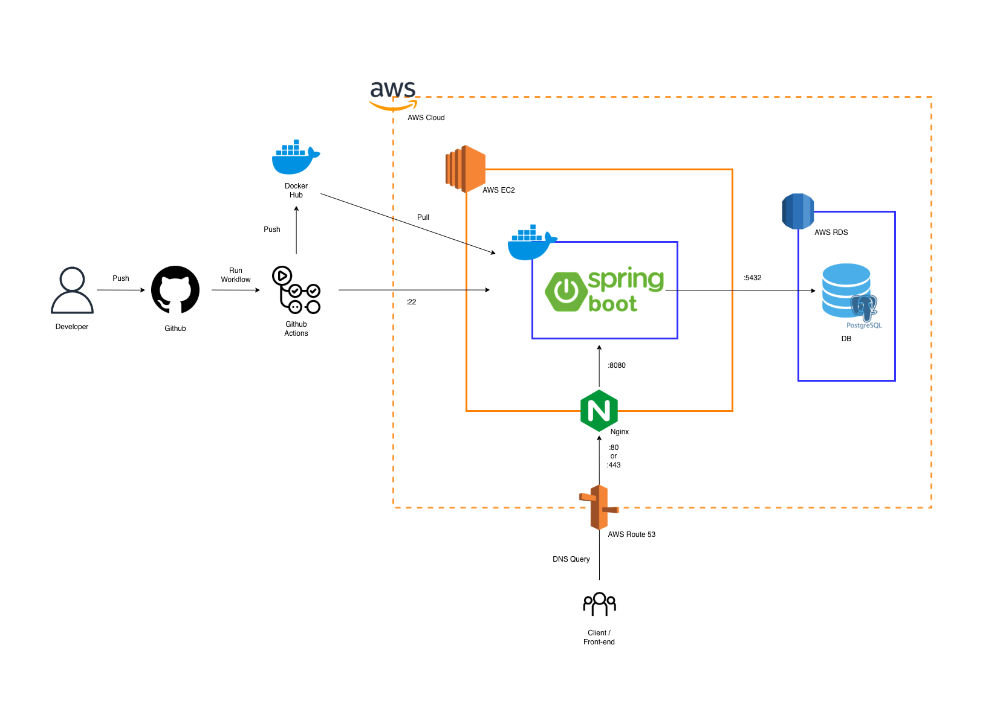
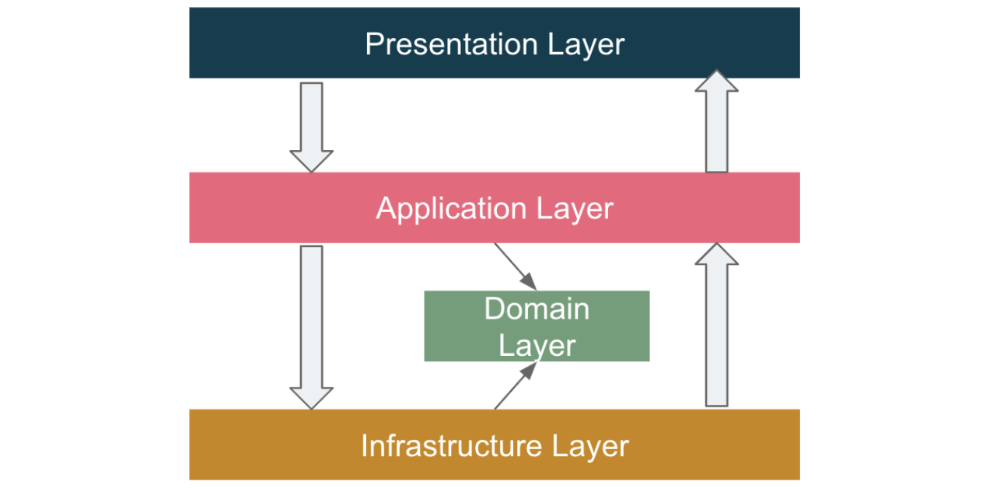
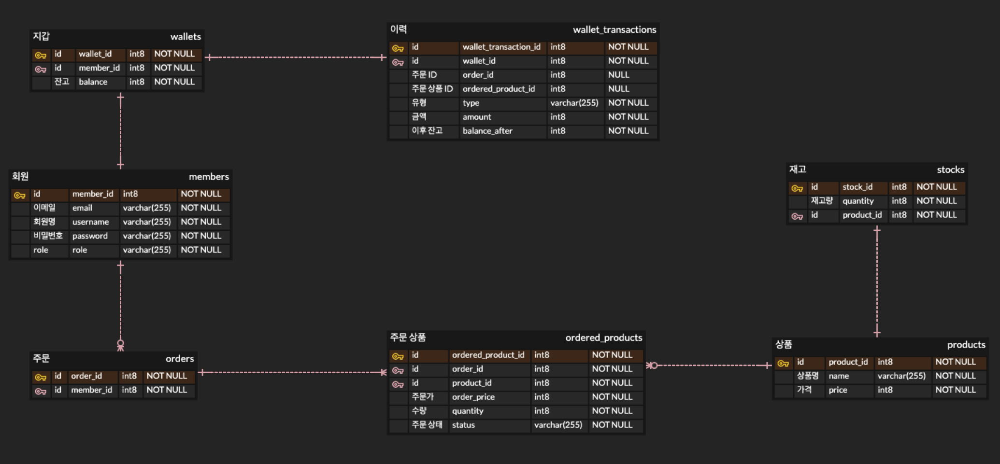

# Order Management API Server
Spring Boot 기반의 주문 관리 API 백엔드 서버입니다.

## Overview
회원, 주문, 상품을 중심으로 주문 관리 백엔드 서버의 기능을 구현한 토이 프로젝트입니다.
- [Features](#features)
- [Tech Stack](#tech-stack)
- [Project Architecture](#project-architecture)
- [Project Structure](#project-structure)
- [ERD](#erd)
- [API Documentation](#api-documentation)
- [Troubleshooting](#troubleshooting)
- [Getting Started](#getting-started)

## Features
주요 기능은 다음과 같습니다.

- 상품 생성 및 조회
- 주문 생성 및 조회
- 주문 상품 조회
- 주문 상품 상태 변경
- 사용자 조회
- 충전 / 결제 / 취소 트랜잭션 조회
- 회원가입과 로그인 

## Tech Stack
사용한 기술스택은 다음과 같습니다.

- Language: Java 17  
- Framework: Spring Boot 3  
- ORM: Spring Data JPA (Hibernate)  
- Database: PostgreSQL (AWS RDS)
- Security: Spring Security (JWT)
- Infra: Docker, AWS (EC2, RDS, Route 53), Nginx
- CI/CD: GitHub Actions
- Build Tool: Gradle
- Test: JUnit 5, Mockito

## Project Architecture
프로젝트의 아키텍쳐는 다음과 같습니다.


## Project Structure
프로젝트의 구조는 다음과 같습니다.


도메인 중심 설계를 기반으로 계층 간 역할을 분리했습니다.
- Presentation: API 요청/응답 처리 (Controller)
- Application: 비즈니스 로직 및 서비스 계층
- Domain: 핵심 도메인 모델 및 규칙
- infrastructure: DB, 외부 시스템 연동

## ERD
프로젝트의 ERD는 다음과 같습니다. 
- ERDCloud: https://www.erdcloud.com/d/49QazgufuMhYAPgwL



### 설계 의도

#### 1. 회원 - 지갑 1:1 분리

회원과 지갑을 분리하여 잔고 관련 로직을 독립적으로 관리할 수 있도록 설계했습니다.

- 잔고(금액)는 도메인 특성상 변경이 잦고 트랜잭션이 중요한 데이터
- 회원 정보와 분리하여 책임을 명확히 분리 (SRP)
- 추후 포인트, 쿠폰 등 확장 가능성을 고려

#### 2. 상품 - 재고 1:1 분리

상품과 재고를 분리하여 재고 관리의 독립성과 확장성을 확보했습니다.

- 재고는 동시성 이슈가 발생할 수 있는 핵심 데이터
- 상품 정보와 분리하여 재고 처리 로직을 독립적으로 관리
- 향후 다중 창고, 재고 이력 관리 등 확장 가능성 고려

#### 3. 주문 - 주문 상품 - 상품

주문과 상품은 다대다(N:M) 관계이기 때문에, 중간 테이블(주문 상품)을 통해 관계를 분리했습니다.

- 하나의 주문에는 여러 상품이 포함될 수 있음
- 하나의 상품은 여러 주문에 포함될 수 있음

또한 단순 관계 해소뿐만 아니라, 주문 시점의 추가 정보를 저장하기 위해 별도 엔티티로 설계했습니다.

- 주문 당시 가격
- 수량
- 주문 상태

이를 통해 주문 데이터의 정합성과 확장성을 확보했습니다.

## API Documentation

#### Base URL
- Dev: http://localhost:8080
- Prod: https://poststory.co.kr

#### Swagger UI
- Local: http://localhost:8080/swagger-ui/index.html
- Prod: https://poststory.co.kr/swagger-ui/index.html 

#### Authentication
이 API는 JWT 기반 인증을 사용합니다.
```bash
Authorization: Bearer <ACCESS_TOKEN>
```
Swagger UI에서 인증 방법:

1. api/auth/login API로 access token 발급
2. Swagger 상단의 Authorize 버튼 클릭
3. 아래 형식으로 입력
<ACCESS_TOKEN>
4. 이후 인증이 필요한 API 호출 가능

#### Notes
- 모든 요청은 JSON 형식입니다.
- 인증이 필요한 API는 Authorization 헤더를 포함해야 합니다.

## Troubleshooting

## Getting Started

### 1. Clone Repository
```bash
git clone https://github.com/kgjun0314/e-commerce-backend.git
cd e-commerce-backend
```

### 2. Create .env File
프로젝트 루트에 다음처럼 .env 파일을 생성해주세요.
```bash
# Database
POSTGRES_USER=user
POSTGRES_PASSWORD=1234
POSTGRES_DB=postgres

# JWT
JWT_SECRET=yoursecretkeyyoursecretkeyyoursecretkeyyoursecretkeyyoursecretkey

# Spring Profile
SPRING_PROFILES_ACTIVE=dev
```

### 3. Build & Run
```bash
./gradlew clean bootJar
docker-compose up -d --build
# 또는 
# ./gradlew clean bootJar
# docker compose up -d --build
```